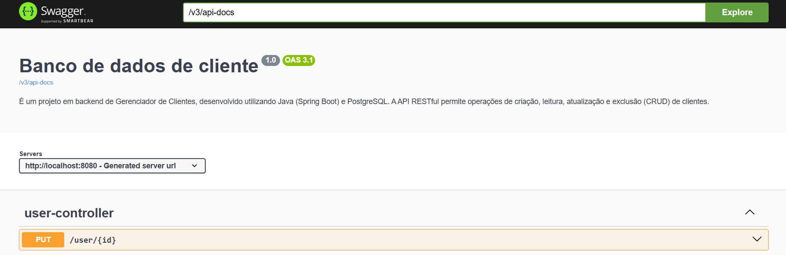
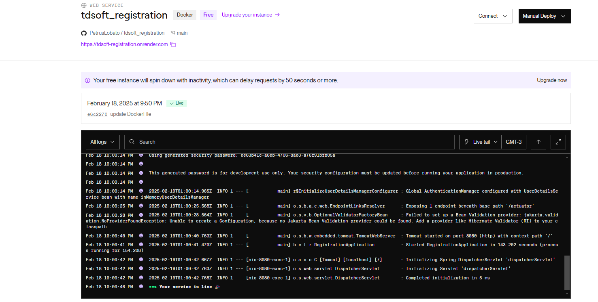

# tdsoft_registration


<center>
<p  align="center">Métricas deste projeto:</p>
<p  align="center">


</p>
</center>


## Descrição do Projeto
É um projeto em backend de Gerenciador de Clientes, desenvolvido utilizando Java (Spring Boot) e PostgreSQL. A API RESTful permite operações de criação, leitura, atualização e exclusão (CRUD) de clientes.

## Funcionalidades do Usuario
- Cadastro de usuário.
- Login de usuário com geração de Token.
- Atualização de dados do usuário.
- Integração com banco de dados PostgreSQL.

## Funcionalidades do Usuario com Cliente, relacionamento de 1:N
- Cadastrar um cliente.
- Listagem de todos os clientes.
- Listagem de clientes por usuário.
- Atualização de dados do cliente.
- Deletar cliente.
- Integração com banco de dados PostgreSQL.


## Tecnologias Utilizadas
- [Spring Boot](https://spring.io/projects/spring-boot)
- [PostgreSQL](https://www.postgresql.org/)
- [Spring Data JPA](https://spring.io/projects/spring-data-jpa)
- [Lombok](https://projectlombok.org/)
- [Maven](https://maven.apache.org/)


## Pré-requisitos
- Java 17 ou superior
- Maven 3.6 ou superior
- PostgreSQL instalado e em execução
- Insomnia ou Apidog 

## Configuração do Banco de Dados
Certifique-se de que o PostgreSQL esteja em execução e crie um banco de dados chamado `registration`. 

- Duplique o arquivo ".env.example" e o renomeie para ".env".
- Dentro do arquivo ".env" subistitua as variáveis pelas suas.


## Como Executar o Projeto

1. ### Instalação das dependências:
   
   ```bash
    mvn clean install
   ```
   
2. ### Execução da aplicação:
   ```bash
   mvn spring-boot:run
   ```


   A API estará disponível em [http://localhost:8080](http://localhost:8080).
  

## Documentação do projeto



- Link com a documentação completa do projeto [Documentação](http://localhost:8080/swagger-ui/index.html).


## Como executar os testes

Para entender melhor a funcionalidade do projeto, rode o comando no terminal:
 ```bash
    mvn clean test
   ```

Antes de rodar os testes verifique se seu banco `Postegres` já estar rodando, caso não, verifique as variáveis de ambiente, no arquevo `.env`


## Deploy 

Caso queira criar o deploy o arquivo `Dockerfile` foi criado para gerar imagem para o deploy no Render.




